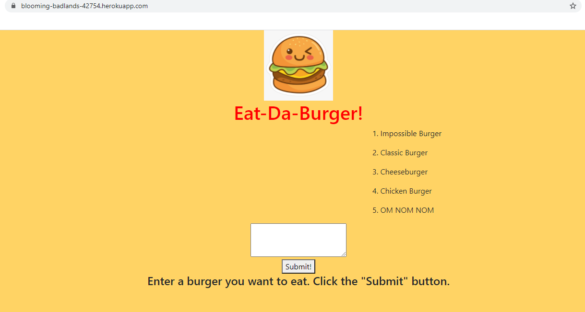

# Eat-Da_Burger

## Table of Contents
[Description](#Description)  
[Installation](#Installation)  

## Description
Add a Burger Name of the burger you want to eat. Click the 'Submit' button to add it to the list. Eat it by clicking the 'Devour it!' button, the eaten burger will move to the list on the right.

 ## Installation
Follow this :link: [Eat Da Burger!](https://blooming-badlands-42754.herokuapp.com/)

Github: https://github.com/phamthomas12